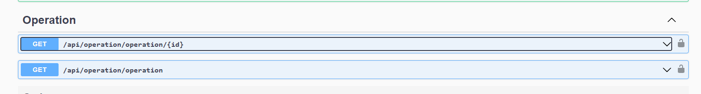

### OperationModule 目前可用API



目前OperationModule提供的API如下：

## 單查api

requestUrl:  
```
/api/operation/operation/{id}
```

回傳範例json

```json
{
  "operationId": "OrderExpireActionHandler.ExecuteAsync",
  "operationName": "訂單即將到期通知",
  "result": "{\"isFailed\":false,\"isSuccess\":true,\"reasons\":[{\"message\":\"曹O卿 沒有 email 無法寄送通知\",\"metadata\":{}}],\"errors\":[],\"successes\":[{\"message\":\"曹O卿 沒有 email 無法寄送通知\",\"metadata\":{}}]}",
  "isSuccess": true,
  "executionDuration": 0,
  "operationResult": {
    "isFailed": false,
    "isSuccess": true,
    "reasons": [
      {
        "message": "曹O卿 沒有 email 無法寄送通知",
        "metadata": {}
      }
    ],
    "errors": [],
    "successes": [
      {
        "message": "曹O卿 沒有 email 無法寄送通知",
        "metadata": {}
      }
    ]
  },
  "operationOwners": [
    {
      "operationId": "5d6fd8e5-f1b2-44b0-6800-3a114e7a1e87",
      "entityType": "Ptcma.Portal.Orders.Order",
      "entityId": "f24119b0-2493-b057-557f-3a114e65f895",
      //metaData為 json字串 格式為 {"key":"value"}
      //key type string
      //value type object
      "metaData": "{}",
      "isDeleted": false,
      "deleterId": null,
      "deletionTime": null,
      "lastModificationTime": null,
      "lastModifierId": null,
      "creationTime": "2024-03-14T09:31:28.4607848Z",
      "creatorId": null,
      "id": "839d2b4b-da52-d205-6bb1-3a114e7a3b21"
    }
  ],
  "isDeleted": false,
  "deleterId": null,
  "deletionTime": null,
  "lastModificationTime": null,
  "lastModifierId": null,
  "creationTime": "2024-03-14T09:31:28.4437535Z",
  "creatorId": null,
  "id": "5d6fd8e5-f1b2-44b0-6800-3a114e7a1e87"
}
```

## 多筆查詢api

requestUrl:  
```
/api/operation/operation
```

可當過濾條件的參數有

- filter: string (搜尋operationName)

- isSuccess: boolean (是否成功)

- creationTime.Max: DataTime (建立時間最大值)

- creationTime.Min: DataTime (建立時間最小值)

- entityType: string (實體類型，目前不開放多筆查詢，待後續擴充)

- entityId: string (實體Id，目前不開放多筆查詢，待後續擴充)

- sorting: string (排序)

- maxResultCount: int (最大回傳筆數)

- skipCount: int (跳過筆數)

回傳範例json

```json
{
  "totalCount": 8,
  "items": [
    {
      "operationId": "CertificateExpireActionHandler.ExecuteAsync",
      "operationName": "證照過期通知",
      "result": "{\"isFailed\":false,\"isSuccess\":true,\"reasons\":[{\"message\":\"已寄送通知給 戴O雄\",\"metadata\":{}}],\"errors\":[],\"successes\":[{\"message\":\"已寄送通知給 戴O雄\",\"metadata\":{}}]}",
      "isSuccess": true,
      "executionDuration": 0,
      "operationResult": {
        "isFailed": false,
        "isSuccess": true,
        "reasons": [
          {
            "message": "已寄送通知給 戴O雄",
            "metadata": {}
          }
        ],
        "errors": [],
        "successes": [
          {
            "message": "已寄送通知給 戴O雄",
            "metadata": {}
          }
        ]
      },
      "operationOwners": [
        {
          "operationId": "0ef28f0c-bc4d-a39f-619a-3a114eb3eb6a",
          "entityType": "Ptcma.Organization.DoctorInfos.DoctorInfo",
          "entityId": "0d04bcaf-7c65-1fb0-bdba-3a114df77191",
          "metaData": "{}",
          "isDeleted": false,
          "deleterId": null,
          "deletionTime": null,
          "lastModificationTime": null,
          "lastModifierId": null,
          "creationTime": "2024-03-14T10:34:40.6685014Z",
          "creatorId": null,
          "id": "816492f8-b9bd-7993-bd89-3a114eb41870"
        }
      ],
      "isDeleted": false,
      "deleterId": null,
      "deletionTime": null,
      "lastModificationTime": null,
      "lastModifierId": null,
      "creationTime": "2024-03-14T10:34:40.6508379Z",
      "creatorId": null,
      "id": "0ef28f0c-bc4d-a39f-619a-3a114eb3eb6a"
    },
  ]
}
```
