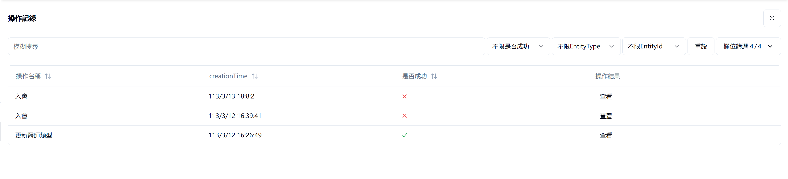
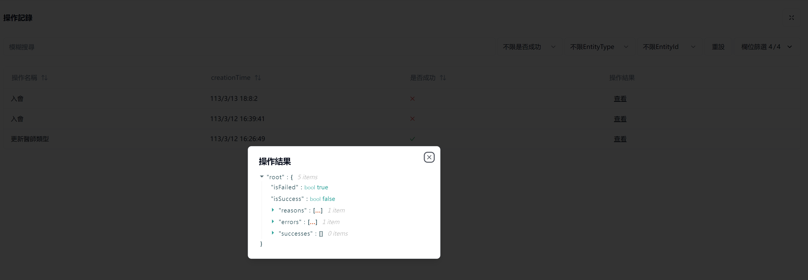

### OperationModuleUI規劃

2024/3/14日 參會人：張銀軒、昱清、孫凱
會中討論Operation模組的UI和接口，UI以表格顯示操作記錄，討論后，需要顯示的欄位和接口的過濾欄位規定如下：

#### 顯示欄位

- 操作名稱
- 建立時間
- 是否成功
- 操作詳情  說明：用json viewer顯示【operationOwners】和【operationResult】中的內容，給開發者看
- 詳細         說明：頁面跳轉，給用戶看的operationResult中reasons欄位的內容

#### 過濾欄位
- 操作名稱
- 創建時間的區間
- 是否成功

#### 功能

現有UI截圖(2024/3/14)

