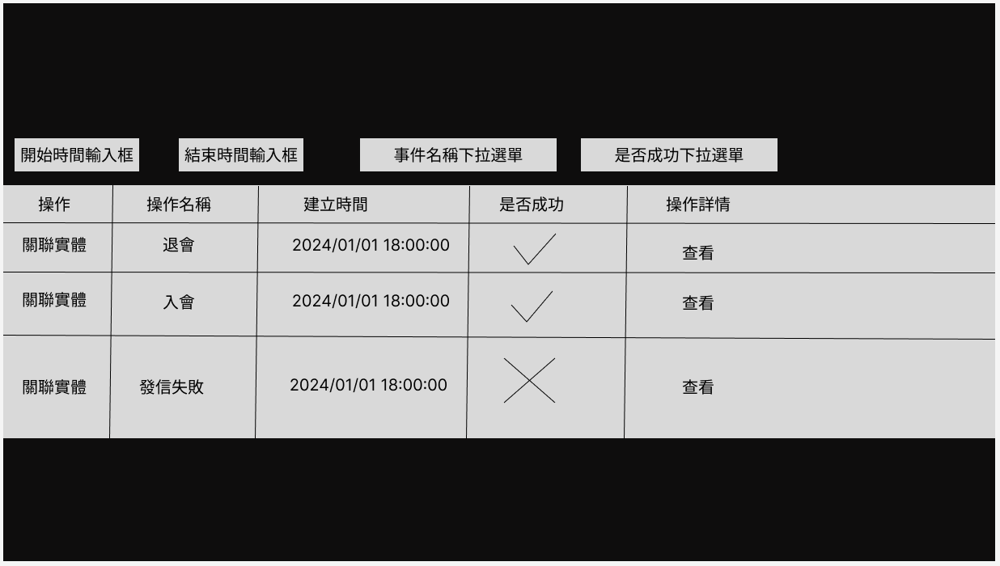
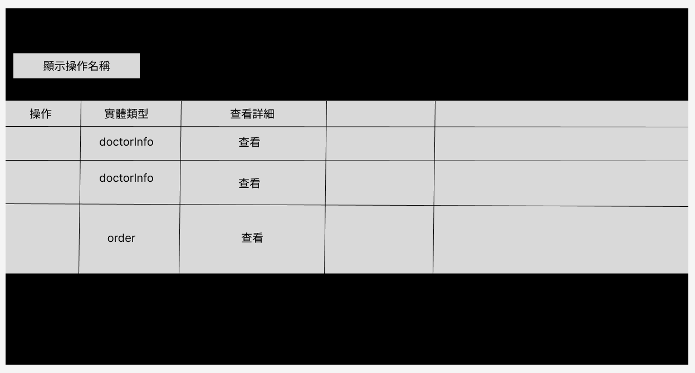
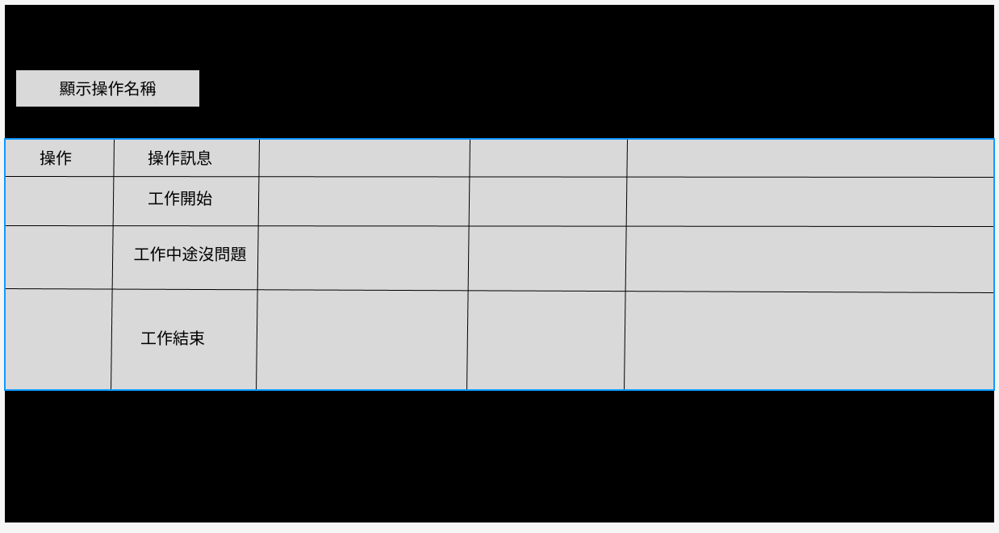

### OperationModuleUI規劃

會中討論Operation模組的UI和接口，UI以表格顯示操作記錄，討論后，需要顯示的欄位和接口的過濾欄位規定如下：

### 頁面一
---

本體Operation草圖

#### 顯示欄位

- 操作      說明：可點擊查看關聯實體
    - 查看關聯實體
    - 查看詳細訊息
- 操作名稱
- 建立時間
- 是否成功
- 操作詳情  說明：用json viewer顯示【operationOwners】和【operationResult】中的內容，給開發者看

#### 過濾欄位
- 操作名稱下拉選單
- 創建時間的區間
- 是否成功下拉選單(成功，失敗，不限)

### 頁面二
---

從操作記錄點擊查看關聯實體，會跳轉到關聯實體的詳細頁面，顯示關聯實體的詳細信息，如下：

查看關聯實體草圖

#### 顯示欄位

- 操作      說明:無功能
- 實體類型
- 操作詳情  說明：用json viewer顯示【metadata】中的內容給開發者看

### 頁面三
---

從操作記錄點擊查看查看詳細訊息，會跳轉到查看詳細訊息的頁面，如下：

查看詳細訊息草圖

#### 顯示欄位

- 操作      說明:無功能
- 操作訊息

### 附件
---

json viewer畫面參考：

