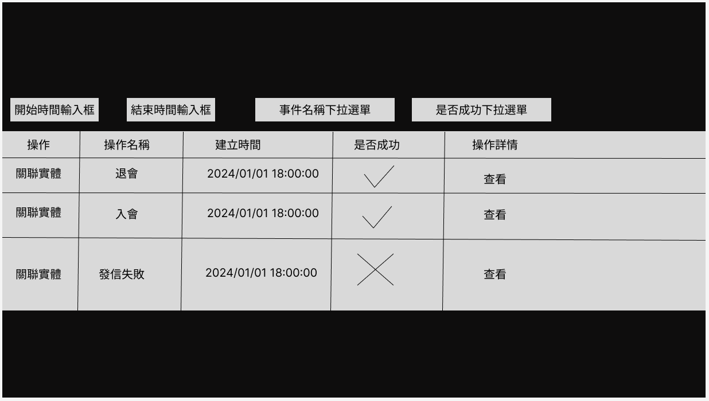
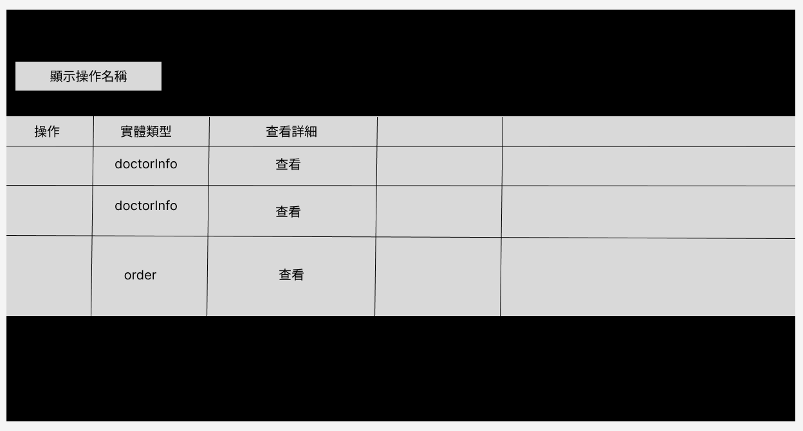
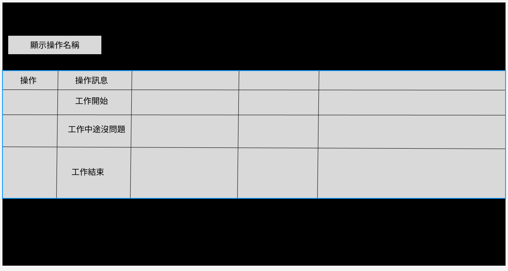
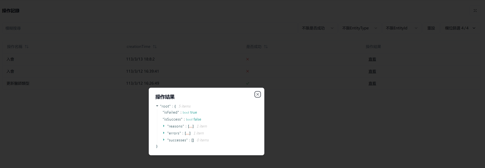

# 概述
## 操作紀錄模組介紹

操作紀錄模組是一個用來記錄使用者操作的模組，它可以記錄使用者的操作紀錄，而且可以進行查詢。
並且利用redis過期事件的特性進行保存

## 操作紀錄模組功能

- 記錄使用者操作紀錄
- 查詢使用者操作紀錄

## 操作紀錄模組使用

實體介紹

```c#
public class OperationInfo
{
    public Guid Id { get; private set; }

    //操作function Name
    public string? OperationId { get; set; }

    //操作名稱
    public string? OperationName { get; set; }

    //過程每個步驟的訊息
    public Result Result { get; } = Result.Ok();

    //整個操作是否完成
    public bool IsSuccess => this.Result.IsSuccess;

    //操作所關聯的實體
    public List<OperationOwnerInfo> Owners { get; } = new();
}
```

使用方式

注入IOperationProvider介面，並且使用CreateOperationAsync方法進行操作紀錄的新增。

```c#
public class OperationSave : ITransientDependency
{
    protected IOperationProvider operationProvider { get; }

    protected OperationSaveTest(IOperationProvider operationProvider)
    {
        this.operationProvider = operationProvider;
    }

    public async Task OperationSaveAsync()
    {
        var operationId = Guid.NewGuid();

        await operationProvider.CreateOperationAsync(operationId, operationInfo =>
        {
            operationInfo.OperationId = operationId.ToString();
            operationInfo.OperationName = "TestOperation";
            operationInfo.Result.WithSuccess(new Success("OperationStore保存成功"));
            operationInfo.Owners.Add(new OperationOwnerInfo
            {
                EntityType = "TestOperationType",
                EntityId = Guid.NewGuid()
            });
        });
    }
}
```
假設你已經新增過操作紀錄，你可以在之前的操作紀錄上做訊息的追加，使用UpdateOperationAsync方法進行操作紀錄的更新。
這樣的設計避免了物件在方法間的傳遞，並且provider記住了currentId，所以不需要再次傳遞Id也能編輯同個物件

```c#
public class OperationSave : ITransientDependency
{
    protected IOperationProvider operationProvider { get; }

    protected OperationSaveTest(IOperationProvider operationProvider)
    {
        this.operationProvider = operationProvider;
    }

    public async Task OperationSaveAsync()
    {
        var operationId = operationProvider.GetCurrentId();

        await operationProvider.UpdateOperationAsync(operationId, operationInfo =>
        {
            operationInfo.OperationId = operationId.ToString();
            operationInfo.OperationName = "TestOperation";
            operationInfo.Result.WithSuccess(new Success("OperationStore保存成功"));
            operationInfo.Owners.Add(new OperationOwnerInfo
            {
                EntityType = "TestOperationType",
                EntityId = Guid.NewGuid()
            });
        });
    }
}
```

目前預設過期時間是5秒，但可在CreateOperationAsync和UpdateOperationAsync方法中設定過期時間。
過期後模駔會自動保存到資料庫中

```c#
Task CreateOperationAsync(Guid id, Action<OperationInfo> action, TimeSpan? slidingExpiration = null);

Task UpdateOperationAsync(Guid id, Action<OperationInfo> action, TimeSpan? slidingExpiration = null);
```

# 安裝說明
## Nuget來源設定
須設定 nuget 來源 `https://nuget.pkg.github.com/fs-tw/index.json`

此為豐碩私人repo，需要使用github帳號，密碼使用github Personal Access Token

## 設定流程
1. 專案引用下列模組，Modeul檔加上DependsOn:
    - Host/DbMigrator: Further.Abp.Operation
    - HttpApi: Further.Operation.HttpApi
    - Application: Further.Operation.Application.Contracts
    - ApplicationContracts: Further.Operation.Application.Contracts
    - Domain: Further.Operation.Domain
    - DomainShared: Further.Operation.Domain.Shared
    - EntityFrameWorkCore: Further.Operation.EntityFrameworkCore
2. Operation設定Owner需要事先註冊。請在Domain module的ConfigureServices根據為需要的Entity註冊
```csharp
Configure<FurtherOperationOptions>(options =>
{
    options.EntityTypes.Add(new OperationOwnerTypeDefinition(typeof(YourEntityA).FullName));
    options.EntityTypes.Add(new OperationOwnerTypeDefinition(typeof(YourEntityB).FullName));
});
```
3. 讓模組的DbContext繼承IOperationDbContext,並且在DbContext上加上ReplaceDbContext，之後補上dbSet和OnModelCreating的設定
```csharp
//IYourModuleDbContext.cs
public partial interface IYourModuleDbContext : Further.Operation.EntityFrameworkCore.IOperationDbContext;

//YourDbContext.cs
[ReplaceDbContext(typeof(IOperationDbContext))]
public partial class YourDbContext : AbpDbContext<YourDbContext>, IYourModuleDbContext
{
    //加上IOperationDbContext的DbSet
    public DbSet<Operation> Operations { get; set; }

    public DbSet<OperationOwner> OperationOwners { get; set; }


    protected override void OnModelCreating(ModelBuilder builder)
    {
        base.OnModelCreating(builder);
        //...其他設定

        //加上ConfigureOperation
        builder.ConfigureOperation();
    }
}
```

4. 新增Migration，此時應該會看到Migration新增了Operation和OperationOwner的table

5. AppSettings需要設定Operation參數和Redis連線，要注意若同時有兩個host啟用IsEnableSubscribe，資料會重複建立，請確保只有一個host啟用IsEnableSubscribe
```json
"Operation": 
{
    "IsEnableSubscribe": true
},
"Redis": 
{
    "Configuration": "127.0.0.1"
}
```

# API
## OperationModule 目前可用API


目前OperationModule提供的API如下：

## 單查api

requestUrl:  
```
/api/operation/operation/{id}
```

回傳範例json

```json
{
  "operationId": "OrderExpireActionHandler.ExecuteAsync",
  "operationName": "訂單即將到期通知",
  "result": "{\"isFailed\":false,\"isSuccess\":true,\"reasons\":[{\"message\":\"曹O卿 沒有 email 無法寄送通知\",\"metadata\":{}}],\"errors\":[],\"successes\":[{\"message\":\"曹O卿 沒有 email 無法寄送通知\",\"metadata\":{}}]}",
  "isSuccess": true,
  "executionDuration": 0,
  "operationResult": {
    "isFailed": false,
    "isSuccess": true,
    "reasons": [
      {
        "message": "曹O卿 沒有 email 無法寄送通知",
        "metadata": {}
      }
    ],
    "errors": [],
    "successes": [
      {
        "message": "曹O卿 沒有 email 無法寄送通知",
        "metadata": {}
      }
    ]
  },
  "operationOwners": [
    {
      "operationId": "5d6fd8e5-f1b2-44b0-6800-3a114e7a1e87",
      "entityType": "Ptcma.Portal.Orders.Order",
      "entityId": "f24119b0-2493-b057-557f-3a114e65f895",
      //metaData為 json字串 格式為 {"key":"value"}
      //key type string
      //value type object
      "metaData": "{}",
      "isDeleted": false,
      "deleterId": null,
      "deletionTime": null,
      "lastModificationTime": null,
      "lastModifierId": null,
      "creationTime": "2024-03-14T09:31:28.4607848Z",
      "creatorId": null,
      "id": "839d2b4b-da52-d205-6bb1-3a114e7a3b21"
    }
  ],
  "isDeleted": false,
  "deleterId": null,
  "deletionTime": null,
  "lastModificationTime": null,
  "lastModifierId": null,
  "creationTime": "2024-03-14T09:31:28.4437535Z",
  "creatorId": null,
  "id": "5d6fd8e5-f1b2-44b0-6800-3a114e7a1e87"
}
```

## 多筆查詢api

requestUrl:  
```
/api/operation/operation
```

可當過濾條件的參數有

- filter: string (搜尋operationName)

- isSuccess: boolean (是否成功)

- creationTime.Max: DataTime (建立時間最大值)

- creationTime.Min: DataTime (建立時間最小值)

- entityType: string (實體類型，目前不開放多筆查詢，待後續擴充)

- entityId: string (實體Id，目前不開放多筆查詢，待後續擴充)

- sorting: string (排序)

- maxResultCount: int (最大回傳筆數)

- skipCount: int (跳過筆數)

回傳範例json

```json
{
  "totalCount": 8,
  "items": [
    {
      "operationId": "CertificateExpireActionHandler.ExecuteAsync",
      "operationName": "證照過期通知",
      "result": "{\"isFailed\":false,\"isSuccess\":true,\"reasons\":[{\"message\":\"已寄送通知給 戴O雄\",\"metadata\":{}}],\"errors\":[],\"successes\":[{\"message\":\"已寄送通知給 戴O雄\",\"metadata\":{}}]}",
      "isSuccess": true,
      "executionDuration": 0,
      "operationResult": {
        "isFailed": false,
        "isSuccess": true,
        "reasons": [
          {
            "message": "已寄送通知給 戴O雄",
            "metadata": {}
          }
        ],
        "errors": [],
        "successes": [
          {
            "message": "已寄送通知給 戴O雄",
            "metadata": {}
          }
        ]
      },
      "operationOwners": [
        {
          "operationId": "0ef28f0c-bc4d-a39f-619a-3a114eb3eb6a",
          "entityType": "Ptcma.Organization.DoctorInfos.DoctorInfo",
          "entityId": "0d04bcaf-7c65-1fb0-bdba-3a114df77191",
          "metaData": "{}",
          "isDeleted": false,
          "deleterId": null,
          "deletionTime": null,
          "lastModificationTime": null,
          "lastModifierId": null,
          "creationTime": "2024-03-14T10:34:40.6685014Z",
          "creatorId": null,
          "id": "816492f8-b9bd-7993-bd89-3a114eb41870"
        }
      ],
      "isDeleted": false,
      "deleterId": null,
      "deletionTime": null,
      "lastModificationTime": null,
      "lastModifierId": null,
      "creationTime": "2024-03-14T10:34:40.6508379Z",
      "creatorId": null,
      "id": "0ef28f0c-bc4d-a39f-619a-3a114eb3eb6a"
    },
  ]
}
```

# UI和UX規劃
## OperationModuleUI規劃

會中討論Operation模組的UI和接口，UI以表格顯示操作記錄，討論后，需要顯示的欄位和接口的過濾欄位規定如下：

## 頁面一
---

本體Operation草圖


### 顯示欄位

- 操作      說明：可點擊查看關聯實體
    - 查看關聯實體
    - 查看詳細訊息
- 操作名稱
- 建立時間
- 是否成功
- 操作詳情  說明：用json viewer顯示【operationOwners】和【operationResult】中的內容，給開發者看

### 過濾欄位
- 操作名稱下拉選單
- 創建時間的區間
- 是否成功下拉選單(成功，失敗，不限)

## 頁面二
---

從操作記錄點擊查看關聯實體，會跳轉到關聯實體的詳細頁面，顯示關聯實體的詳細信息，如下：

查看關聯實體草圖


### 顯示欄位

- 操作      說明:無功能
- 實體類型
- 操作詳情  說明：用json viewer顯示【metadata】中的內容給開發者看

## 頁面三
---

從操作記錄點擊查看查看詳細訊息，會跳轉到查看詳細訊息的頁面，如下：

查看詳細訊息草圖


### 顯示欄位

- 操作      說明:無功能
- 操作訊息

## 附件
---

json viewer畫面參考：



# 實體規劃
### OperationModule 實體規劃


實體欄位介紹

實體介紹

Operation 本體，為保存操作紀錄的主要實體，每一次操作都會產生一筆Operation紀錄
```c#
public class Operation
{
    public Guid Id { get; private set; }

    //操作function Name
    public string OperationId { get; set; }

    //操作名稱
    public string OperationName { get; set; }

    //過程每個步驟的訊息
    public Result Result { get; set; }

    //整個操作是否完成，通常為Result的IsSuccess
    public bool IsSuccess {get;set;}

    //執行消耗時間(可能考慮移除)
    public int ExecutionDuration { get; set; }

    //操作所關聯的實體
    public List<OperationOwner> Owners { get; } = new();
}
```

Result物件，主要訊息的保存位置


```c#
public class OperationResult
{
    //當error有任何一筆即為false
    public  bool IsSuccess { get; set; }

    //為IsSuccess的相反
    public  bool IsFailed { get; set; }

    //操作訊息，不管是成功或失敗都會複製一分到Reasons
    public  List<OperationReason> Reasons { get; set; } = new();

    //操作失敗的訊息
    public  List<OperationReason> Errors { get; set; } = new();

    //操作成功的訊息
    public  List<OperationReason> Successes { get; set; } = new();
}

public class OperationReason
{
    public string Message { get; set; } = null!;

    //任意額外資訊
    public Dictionary<string, object> Metadata { get; set; } = new();
}
```

OperationOwner，保存跟這次操作有關的實體資訊
```c#
public class OperationOwner
{
    public Guid Id { get; private set; }

    public Guid OperationId { get; set; }

    //關聯實體type的fullName
    public string EntityType { get; set; }

    //關聯實體的Id
    public Guid EntityId { get; set; }

    //任意額外資訊
    public Dictionary<string, object> MetaData { get; set; }
}
```
