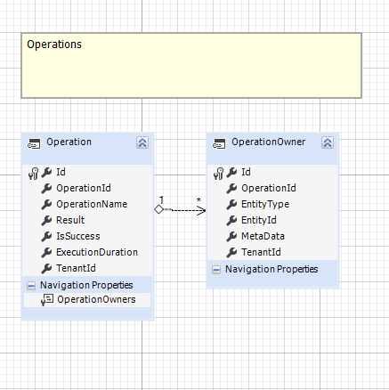

### OperationModule 實體規劃



實體欄位介紹

實體介紹

Operation 本體，為保存操作紀錄的主要實體，每一次操作都會產生一筆Operation紀錄
```c#
public class Operation
{
    public Guid Id { get; private set; }

    //操作function Name
    public string OperationId { get; set; }

    //操作名稱
    public string OperationName { get; set; }

    //過程每個步驟的訊息
    public Result Result { get; set; }

    //整個操作是否完成，通常為Result的IsSuccess
    public bool IsSuccess {get;set;}

    //執行消耗時間(可能考慮移除)
    public int ExecutionDuration { get; set; }

    //操作所關聯的實體
    public List<OperationOwner> Owners { get; } = new();
}
```

Result物件，主要訊息的保存位置


```c#
public class OperationResult
{
    //當error有任何一筆即為false
    public  bool IsSuccess { get; set; }

    //為IsSuccess的相反
    public  bool IsFailed { get; set; }

    //操作訊息，不管是成功或失敗都會複製一分到Reasons
    public  List<OperationReason> Reasons { get; set; } = new();

    //操作失敗的訊息
    public  List<OperationReason> Errors { get; set; } = new();

    //操作成功的訊息
    public  List<OperationReason> Successes { get; set; } = new();
}

public class OperationReason
{
    public string Message { get; set; } = null!;

    //任意額外資訊
    public Dictionary<string, object> Metadata { get; set; } = new();
}
```

OperationOwner，保存跟這次操作有關的實體資訊
```c#
public class OperationOwner
{
    public Guid Id { get; private set; }

    public Guid OperationId { get; set; }

    //關聯實體type的fullName
    public string EntityType { get; set; }

    //關聯實體的Id
    public Guid EntityId { get; set; }

    //任意額外資訊
    public Dictionary<string, object> MetaData { get; set; }
}
```

